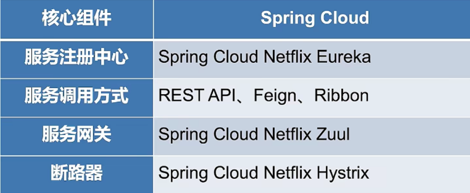
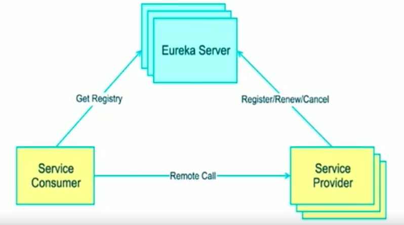
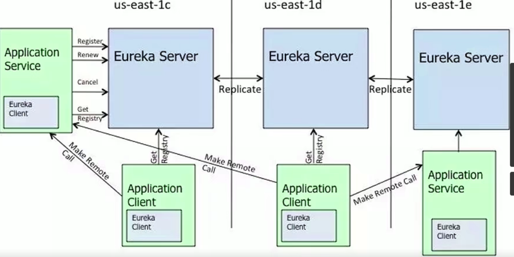
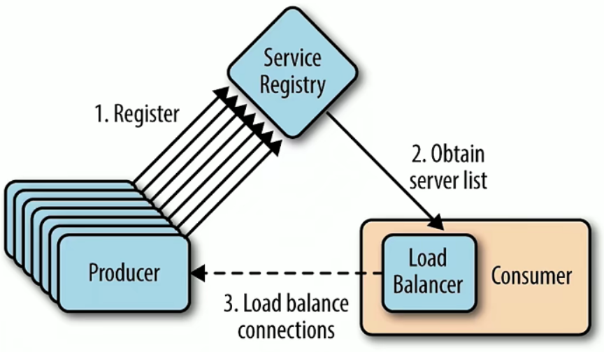

#### 微服务基础

重要模块：

- 服务描述
- 注册中心
- 服务框架
- 负载均衡
- 熔断与降级
- 网关

#### Spring Cloud



#### Spring cloud最小案例开发


开发两个服务模块，课程列表服务，查询数据库中已经上架了的课程列表；课程价格服务，提供课程对应的价格。最终整合课程列表服务和价格。

#### 课程列表服务模块开发：springboot+mybatis查询并展示：

课程实体类：

```java
public class Course implements Serializable {
    private Integer id;
    private Integer courseId;
    private String courseName;
    private Integer valid;
    // setter getter
}
```

课程列表持久层：

```java
@Mapper
public interface CourseMapper {
    @Select("select  * from  course where valid = 1")
    List<Course> findValidCourses();
}
```

服务列引用上述接口

实际控制类：

```java
@RestController
public class CourseListController {
    @Autowired
    private CourseListService courseListService;

    @GetMapping("/courses")
    public List<Course> courseList(){
        return  courseListService.getCourseList();
    }
}
```

#### 课程价格模块开发

配置如下：

```java
server.port=8082
spring.datasource.driver-class-name=com.mysql.cj.jdbc.Driver
spring.datasource.url=jdbc:mysql://localhost:3307/course_practice?serverTimezone=UTC&useUnicode=true&characterEncoding=utf-8&useSSL=true
spring.datasource.username=root
spring.datasource.password=19980805xxl

logging.pattern.console=%clr(%d{${LOG_DATEFORMAT_PATTERN:HH:mm:ss.SSS}}){faint} %clr(${LOG_LEVEL_PATTERN:-%5p}) %clr(${PID:- }){magenta} %clr(---){faint} %clr([%15.15t]){faint} %clr(%-40.40logger{39}){cyan} %clr(:){faint} %m%n${LOG_EXCEPTION_CONVERSION_WORD:%wEx}
mybatis.configuration.map-underscore-to-camel-case=true
spring.application.name=course-price
```

服务接口实现与列表模块相似，sql查询语句：

```java
@Select("select * from course_price where course_id = #{courseId}")
```

注意实体类要实现序列化接口，有setter和getter方法。

控制层：

```java
@Autowired
    private CoursePriceService coursePriceService;

    @GetMapping("/price")
    public Integer getCoursePrice(@RequestParam("courseId") Integer courseId){
        CoursePrice coursePrice = coursePriceService.getCoursePrice(courseId);
        return  coursePrice.getPrice();
    }
```

#### Eureka - 服务中心

服务注册与发现的机制。

Eureka架构：Eureka Server 和Eureka client



集群：



服务提供者，在启动时把自己注册到Eureka服务器上（定期续约，服务下线）。

服务消费者：通过请求找到Eureka服务器，拿到服务清单，根据清单调用。

Eureka服务：服务注册和维护，失效剔除。

#### 整合Eureka

1. 引入依赖

   在多模块springboot项目中，需要在eureka依赖的父模块下添加下面语句：

   ```xml
   <modules>
   		<module>service</module>
           <module>eureka-server</module>
   </modules>
   <!-- 父模块配置pom-->
   <!--	统一spring cloud的版本-->
   	<dependencyManagement>
   		<dependencies>
   			<dependency>
   				<groupId>org.springframework.cloud</groupId>
   				<artifactId>spring-cloud-dependencies</artifactId>
   				<version>Greenwich.SR5</version>
   				<type>pom</type>
   				<scope>import</scope>
   			</dependency>
   		</dependencies>
   	</dependencyManagement>
   ```

   在eureka server上添加相关依赖：

   ```java
   <dependency>
               <groupId>org.springframework.cloud</groupId>
               <artifactId>spring-cloud-starter-netflix-eureka-server</artifactId>
           </dependency>
   ```

2. 配置文件，编写配置文件，指定服务端口，当前为服务节点和提供服务的地址

   ```properties
   spring.application.name=eureka-server
   server.port=8000
   eureka.instance.hostname=localhost
   # 获取注册表，不需要同步其他节点数据
   eureka.client.fetch-registry=false
   # 是否将自己注册到server
   eureka.client.register-with-eureka=false
   eureka.client.service-url.defaultZone=http://${eureka.instance.hostname}:${server.port}/eureka/
   ```

3. 启动注解

   ```java
   @SpringBootApplication
   @EnableEurekaServer
   public class EurekaServerApplication {
       public static void main(String[] args) {
           SpringApplication.run(EurekaServerApplication.class, args);
       }
   }
   ```

   将之前写的courselist和courseprice注册到eureka sever中：

   1. 引入依赖，这里因为父依赖中指定了spring cloud的版本，所以不用写版本号：

      ```java
      <dependency>
                  <groupId>org.springframework.cloud</groupId>
                  <artifactId>spring-cloud-starter-netflix-eureka-client</artifactId>
              </dependency>
      ```

   2. 修改配置文件，填写eureka server地址：

      ```pr
      ## eureka server地址
      eureka.client.service-url.defaultZone=http://localhost:8000/eureka/
      ```

#### Feign

用在第3步向生产者请求时（http请求），简化请求配置。



集成Feign，完成服务间的调用。

- 主动调用的模块引入依赖，这里是course-price模块。

  ```java
  <dependency>
              <groupId>org.springframework.cloud</groupId>
              <artifactId>spring-cloud-starter-openfeign</artifactId>
          </dependency>
  ```

- 注册服务类，使用`@FeignClient`指定调用的服务模块。

  ```java
      @FeignClient("course-list") // 针对course-list服务
      public interface CourseListClient {
  
      // 需要指定服务请求的方法和路径
      @GetMapping("/courses")
      List<Course> courseList();
  }
  ```

- 在控制层调用client的接口：·

  ```java
  @GetMapping("/coursesInPrice")
      public List<Course> getCourseInPrice(){
          return courseListClient.courseList();
      }
  ```

#### 利用Ribbon实现负载均衡

- 客户端负载均衡（Ribbon）
- 服务端负载均衡（Nginx）

负载均衡策略：

- RandomRule：随机策略
- RoundRobinRule：轮询
- ResponseTimeWeightedRule：响应时间加权。

整合，在主动调用模块的配置文件加上：

```properties
#设置负载均衡策略
course-list.ribbon.NFLoadBanlancerRuleClassName=com.netflix.loadbalancer.RoundRobinRule
```

#### 利用Hystrix实现断路器

给course-price添加断路器功能：

1. 添加依赖

   ```java
   <dependency>
               <groupId>org.springframework.cloud</groupId>
               <artifactId>spring-cloud-starter-netflix-hystrix</artifactId>
           </dependency>
   ```

2. 配置文件开启断路功能，开启负载均衡策略

   ```properties
   #设置负载均衡策略
   course-list.ribbon.NFLoadBanlancerRuleClassName=com.netflix.loadbalancer.RoundRobinRule
   #打开短路功能
   feign.hystrix.enabled=true
   ```

3. 启动类加上注解`@EnableCircuitBreaker`

4. 编写产生断路后的操作，使用fallback指定处理的类：

   ```java
       @FeignClient(value = "course-list", fallback = CourseListClientHystrix.class) // 针对course-list服务
       @Primary
       public interface CourseListClient {
   
       @GetMapping("/courses")
       List<Course> courseList();
   }
   ```

   断路时的错误处理类：

   ```java
   @Component
   public class CourseListClientHystrix implements CourseListClient{
       // 发生断路时的处理逻辑
       @Override
       public List<Course> courseList() {
           List<Course> defaultCourses = new ArrayList<>();
           Course course = new Course();
           course.setId(1);
           course.setCourseId(1);
           course.setCourseName("默认课程");
           course.setValid(1);
           defaultCourses.add(course);
           return defaultCourses;
       }
   }
   ```

#### 整合两个服务

将课程的价格整合到课程列表中

course-price控制层代码：

```java
@GetMapping("/courseAndPrice")
    public List<CourseAndPrice> getCourseAndPrice(){
        return coursePriceService.getCourseAndPrice();
    }
```

实现类：

```java
// 先引入course-list服务
@Autowired
private CourseListClient courseListClient;
后面的逻辑就是数据库查询和封装了
```

#### 通过网关Zuul实现路由功能

鉴权和路由。

**集成**

- 引入依赖，启动 类注解`@EnableZuulProxy`

  ```xml
      <dependencies>
          <dependency>
              <groupId>org.springframework.cloud</groupId>
              <artifactId>spring-cloud-starter-netflix-eureka-client</artifactId>
          </dependency>
          <dependency>
              <groupId>org.springframework.cloud</groupId>
              <artifactId>spring-cloud-starter-netflix-zuul</artifactId>
          </dependency>
      </dependencies>
  ```

- 编写配置文件，把自己注册到Eureka

  ```properties
  spring.application.name=course-gateway
  server.port=9000
  logging.pattern.console=%clr(%d{${LOG_DATEFORMAT_PATTERN:HH:mm:ss.SSS}}){faint} %clr(${LOG_LEVEL_PATTERN:-%5p}) %clr(${PID:- }){magenta} %clr(---){faint} %clr([%15.15t]){faint} %clr(%-40.40logger{39}){cyan} %clr(:){faint} %m%n${LOG_EXCEPTION_CONVERSION_WORD:%wEx}
  eureka.client.service-url.defaultZone=http://localhost:8000/eureka/
  ```

- 配置路由地址

  ```properties
  zuul.prefix=/imooc
  zuul.routes.course-list.path=/list/**
  // 指定服务名
  zuul.routes.course-list.service-id=course-list
  zuul.routes.course-price.path=/price/**
  zuul.routes.course-price.service-id=course-price

#### 利用网关实现过滤器

- pre过滤器，在路由请求之前运行
- route过滤器可以处理请求的实际路由
- post路由请求后运行的过滤器
- error过滤器，请求过程中发生错时运行。

整合

1. 编写过滤器类继承zuul filter - preFilter，记录请求的时间：

   ```java
   @Component
   public class PreRequestFilter extends ZuulFilter {
       @Override
       public String filterType() {
           // 过滤器类型
           return FilterConstants.PRE_TYPE;
       }
   
       @Override
       public int filterOrder() {
           return 0;
       }
   
       @Override
       public boolean shouldFilter() {
           // 是否启用过滤器 - 业务的逻辑
           return true;
       }
   
       @Override
       public Object run() throws ZuulException {
           // 核心业务处理逻辑代码
           // 获取到上下文
           RequestContext currentContext = RequestContext.getCurrentContext();
           currentContext.set("startTime", System.currentTimeMillis());
           System.out.println("过滤器已经记录时间");
           return null;
       }
   }
   ```

2. postFilter，计算请求的处理时间，打印uri和处理时间：

   ```java
   @Component
   public class PostRequestFilter extends ZuulFilter {
       @Override
       public String filterType() {
           return FilterConstants.POST_TYPE;
       }
   
       @Override
       public int filterOrder() {
           return FilterConstants.SEND_RESPONSE_FILTER_ORDER - 1;
       }
   
       @Override
       public boolean shouldFilter() {
           return true;
       }
   
       @Override
       public Object run() throws ZuulException {
           RequestContext currentContext = RequestContext.getCurrentContext();
           Long startTime = (Long) currentContext.get("startTime");
           long duration = System.currentTimeMillis() - startTime;
           String requestURI = currentContext.getRequest().getRequestURI();
           System.out.println("uri " + requestURI + "; 处理时长 " + duration);
           return null;
       }
   }
   ```

   